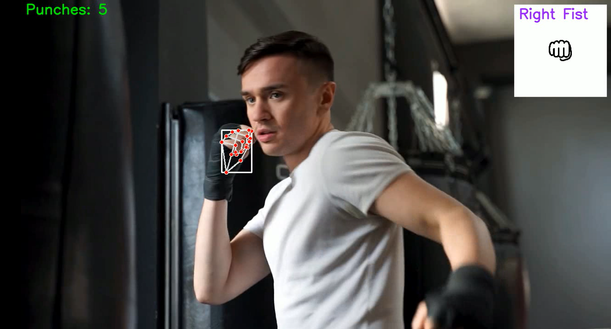

# Boxing&ML

Boxing&ML is a project focused on detecting fists and counting punches during boxing sessions. By leveraging Mediapipe and OpenCV, it provides real-time punch tracking from video feeds, distinguishing between left and right-hand punches with visual overlays for clarity.

## Features

- **Hand Detection**: Utilizes Mediapipe to accurately detect hands in video frames.
- **Fist Detection**: Identifies when a hand forms a fist.
- **Handedness Classification**: Determines if the detected fist belongs to the left or right hand.
- **Punch Counting**: Tracks the number of punches with a delay mechanism to prevent multiple counts for the same punch.
- **Visual Overlays**: Provides a real-time overlay on the video feed to indicate punch detections and counts.

## Demonstration



## Installation

1. Clone the repository:
   ```bash
   git clone https://github.com/your-username/BoxingWithML.git
2. Install the required dependencies:
   ```bash
   pip install -r requirements.txt
3. Run
    ```bash
   python main.py
